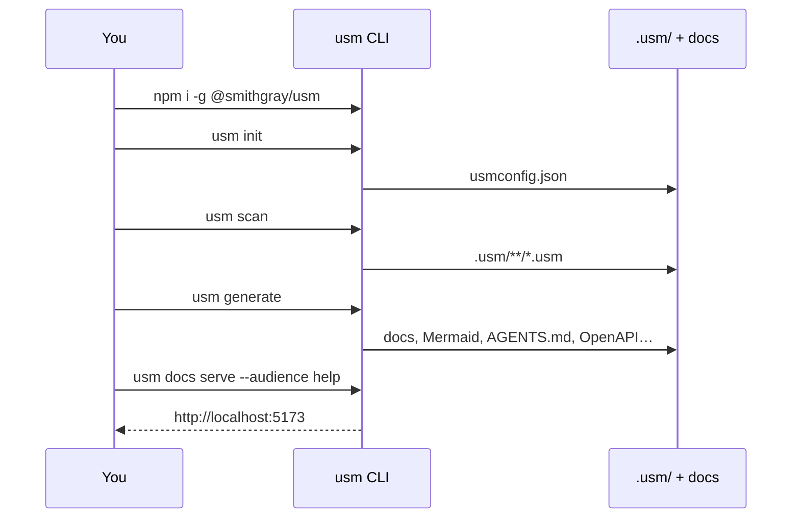

# Getting Started

::: tip
Install → `usm init` → `usm scan` → `usm generate` → `usm docs serve`. Everything below is copy-pasteable.

:::

## The first-run loop



## Quick start

<!-- 1. Install -->
```bash
npm install -g @smithgray/usm
# or: pnpm add -g @smithgray/usm
usm --version
```

<!-- 2. Init + scan -->
```bash
cd your-project
usm init                 # creates usmconfig.json
usm scan                 # detects services, routes, data
# Review .usm/ — this is your source of truth
```

<!-- 3. Generate + serve -->
```bash
usm generate
# Install VitePress (optional but recommended for local docs preview)
npm install -D vitepress    # or: pnpm add -Dw vitepress (monorepo)
usm docs serve --audience help
# Open the printed localhost URL
```

<!-- 4. Wire agents -->
```bash
usm mcp serve            # MCP for Cursor / Claude / Copilot
# See Agent Setup Guide for IDE config
```

## Common first-run issues

::: info
**Node / package manager**: USM requires **Node ≥ 18**. Prefer pnpm 9+ in monorepos. If `usm` is not found after install, check your global bin is on `PATH`.

:::

::: info
**`usm docs serve` fails with "VitePress is not installed"**: VitePress is an optional peer dependency. Install it once: `pnpm add -D vitepress` or `npm install -D vitepress`.

:::

::: info
**Validation warnings about `$version`**: A warning (not an error) means a file's `$version` differs from the schema version this USM understands. Run `usm upgrade` to adopt new optional capabilities.

:::

::: info
**Agents inventing `bugs.md` / ad-hoc tracking files**: Configure feedback policy with `usm feedback`. Default is `human-gate`: agents must ask before filing. Rules files forbid root-level ad-hoc trackers.

:::

## Where to go next

| Page | Why |
| --- | --- |
| [Schema Reference](/schema-reference) | Field-by-field answers for every .usm type |
| [CLI Reference](/cli-reference) | Every command and flag |
| [MCP Tools](/mcp-reference) | Spec-first tools for agents |
| [Agent Setup Guide](/agent-setup-guide) | Cursor / Claude / Copilot wiring |
